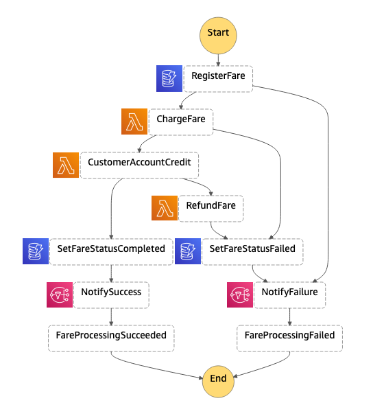

# Study case from AWS LAB
Im using a AWS LAB for my person study

## Choreography and orchestration

AWS Step Functions is a fully managed Serverless workflow management service for managing long running processes and coordinating the components of distributed applications and microservices using visual workflows. But did you know it can also help you deal with the complexities of dealing with a long lived transaction across distributed components in your microservices architecture? In this Builder session, you will learn how AWS Step Function can help us implement the Saga design pattern.

## What problems are we trying to solve?

When building cloud-based distributed architectures, one of the questions we need to ask ourselves is how do we maintain data consistency across microservices that have their own database / persistence mechanism? We do not have support for Distributed Transaction Coordinators (DTC) or two-phase commit protocols responsible for coordinating transactions across multiple cloud resources. We need a mechanism coordinate multiple local transactions.

## What is the Saga Pattern?

A Saga is a design pattern for dealing with “long-lived transactions” (LLT), published by Garcia-Molina and Salem in 1987. Their original paper can be found here [https://www.cs.cornell.edu/andru/cs711/2002fa/reading/sagas.pdf](https://www.cs.cornell.edu/andru/cs711/2002fa/reading/sagas.pdf).

  > “LLT is a saga if it can be written as a sequence of transactions that can be interleaved with other transactions.” (Garcia-Molina, Salem 1987)

Fundamentally it is a failure management pattern, that provides us the means to establish semantic consistency in our distributed applications by providing compensating transactions for every transaction where you have more than one collaborating services or functions.




# Getting started

The Serverless Application Model Command Line Interface (SAM CLI) is an extension of the AWS CLI that adds functionality for building and testing Lambda applications. It uses Docker to run your functions in an Amazon Linux environment that matches Lambda.

To use the SAM CLI, you need the following tools:

* SAM CLI - [Install the SAM CLI](https://docs.aws.amazon.com/serverless-application-model/latest/developerguide/serverless-sam-cli-install.html)
* .NET Core - [Install .NET Core](https://www.microsoft.com/net/download)
* Docker - [Install Docker community edition](https://hub.docker.com/search/?type=edition&offering=community)

To build and deploy your application for the first time, run the following in your shell:

```bash
lab-4$ sam build
lab-4$ sam deploy --guided
```

The first command will build the source of your application. The second command will package and deploy your application to AWS, with a series of prompts:

* **Stack Name**: The name of the stack to deploy to CloudFormation. This should be unique to your account and region, and a good starting point would be something matching your project name.
* **AWS Region**: The AWS region you want to deploy your app to.
* **Confirm changes before deploy**: If set to yes, any change sets will be shown to you before execution for manual review. If set to no, the AWS SAM CLI will automatically deploy application changes.
* **Allow SAM CLI IAM role creation**: Many AWS SAM templates, including this example, create AWS IAM roles required for the AWS Lambda function(s) included to access AWS services. By default, these are scoped down to minimum required permissions. To deploy an AWS CloudFormation stack which creates or modified IAM roles, the `CAPABILITY_IAM` value for `capabilities` must be provided. If permission isn't provided through this prompt, to deploy this example you must explicitly pass `--capabilities CAPABILITY_IAM` to the `sam deploy` command.
* **Save arguments to samconfig.toml**: If set to yes, your choices will be saved to a configuration file inside the project, so that in the future you can just re-run `sam deploy` without parameters to deploy changes to your application.

You can find your API Gateway Endpoint URL in the output values displayed after deployment.

After deployment is complete you can run the following command to retrieve the API Gateway Endpoint URL:

```bash
lab-4$ aws cloudformation describe-stacks \
    --stack-name STACK_NAME\
    --query 'Stacks[].Outputs' \
    --output table
```

